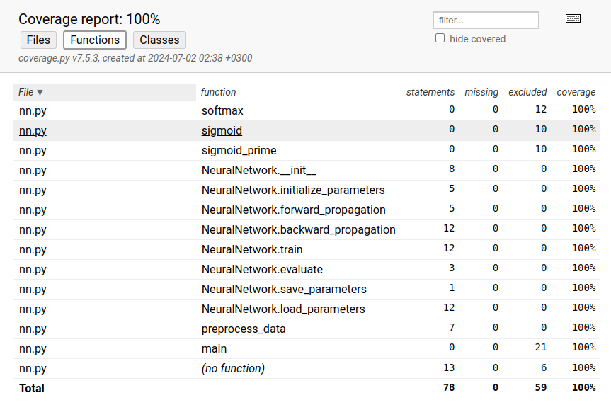
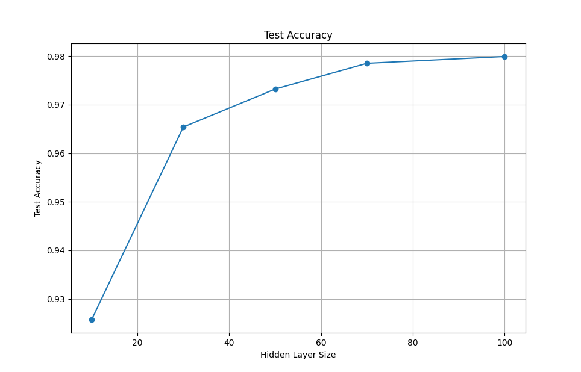

# Testausraportti

### Yksikkötestit

Yksikkötesteissä käytetään unittest-kirjastoa. Automaattisilla testeillä testataan src/nn.py. Käyttöliittymän koodi on jätetty testien ulkopuolelle. Testikattavuus on 100% kattaen aktivaatiofunktioita ja main-funktiota lukuunottamatta muut funktiot.  



### Integraatiotestit

Neuroverkon kohdalla on haastavaa luoda testejä, jotka osoittaisivat, että verkko toimii absoluuttisen oikein.
Sen sijaan testeillä pyrin osoittamaan, että neuroverkossa on potentiaalia toimia, eikä siellä ole selviä virheitä.

Testaan tapahtuuko neuroverkossa ylisovittaminen (overfitting), kun sitä ajetaan pienellä training datan otoksella.
Tässä testissä 100% luokittelutarkkuuden saavuttaminen koulutusdatalla tulkitaan ylisovittumiseksi.
Testin läpäisy osoittaa, että neuroverkko kykenee minimoimaan virhefunktiota ainakin jollain tasolla,
ja että parametrien iteratiivinen päivitys johtaa verkon tarkkuuden paranemiseen.

Lisäksi testaan muuttuvatko painot ja biasin koulutuksen aikana. Tarkistan kerroksittain onko alkutilanteen 
ja koulutuksen jälkeisen tilanteen parametrien välinen erotus nollasta poikkeava. Testin läpäisy edellyttää, että jokin paino ja jokin bias ovat muuttuneet sekä piilo-
että ulostulokerroksessa. Jokaisen parametrin muuttumista ei voi asettaa ehdoksi,
sillä esimerkiksi w1 -matriisissa on useita arvoja, jotka eivät muutu, sillä syötteessä on paljon nollia.
Testin läpäisy osoittaa, että parametrit päivittyvät kaikissa kerroksissa.

Mini batch -käsittelyn osalta testaan vaikuttaako otoksen järjestyksen muuttaminen luokittelun tulokseen.
Testin läpäisee, mikäli luokittelutulos on sama syötedatan järjestyksestä riippumatta. 
Tämä osoittaa deterministisen datan käsittelyn.


### Neuroverkon luokittelutarkkuus

Neuroverkon tarkkuus tämänhetkisellä arkkitehtuurilla (input-kerros 748 neuronia, piilokerros 30 neuronia ja output-kerros 10 neuronia) on noin 96-97%. Piilokerroksen neuronien määrää kasvattamalla tarkkuus nousee 98%:in. Saavutettu luokittelutarkkuus viittaa siihen, että neuroverkossa tapahtuu oikeita asioita.




### Testien toistaminen

Testit voi suorittaa projektin juurikansiossa komennolla

```bash
pytest
```

Aja testikattavuusraportti komennolla
```bash
coverage report -m --include=src/nn.py
```
